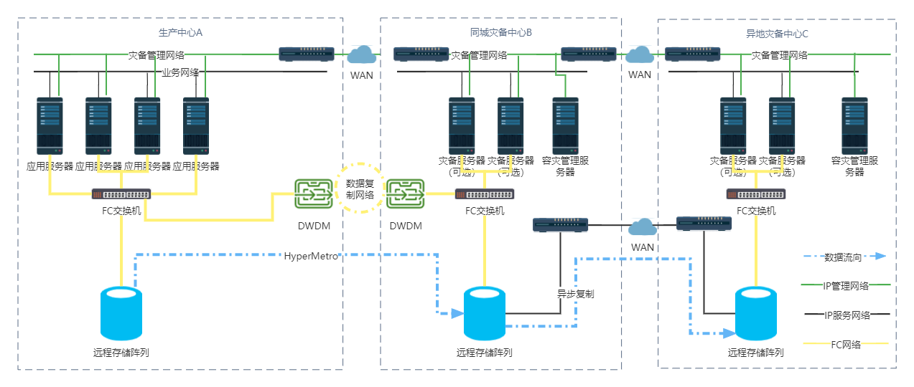
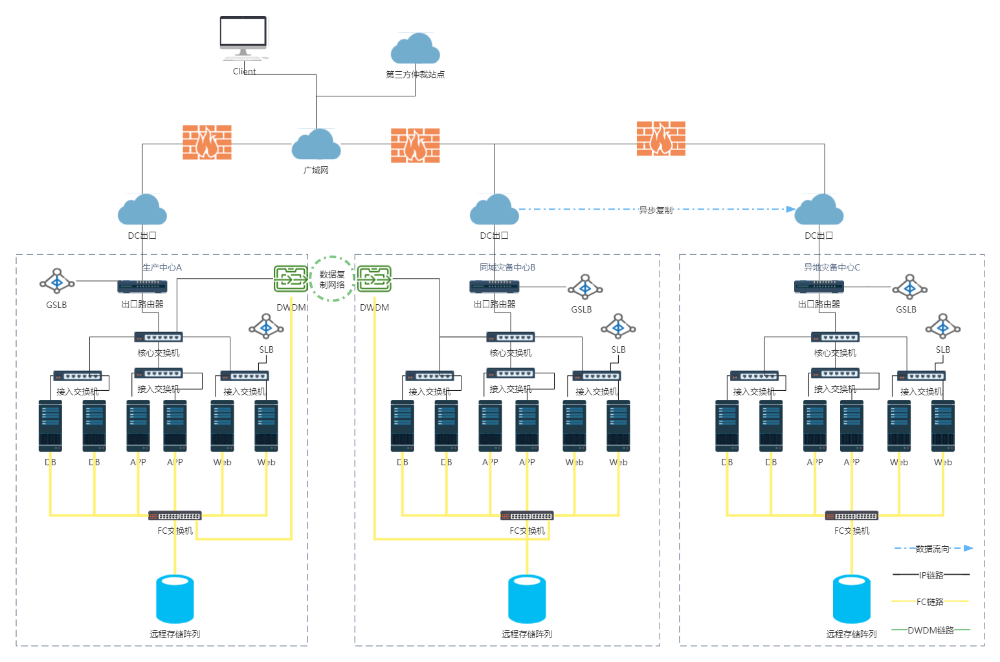
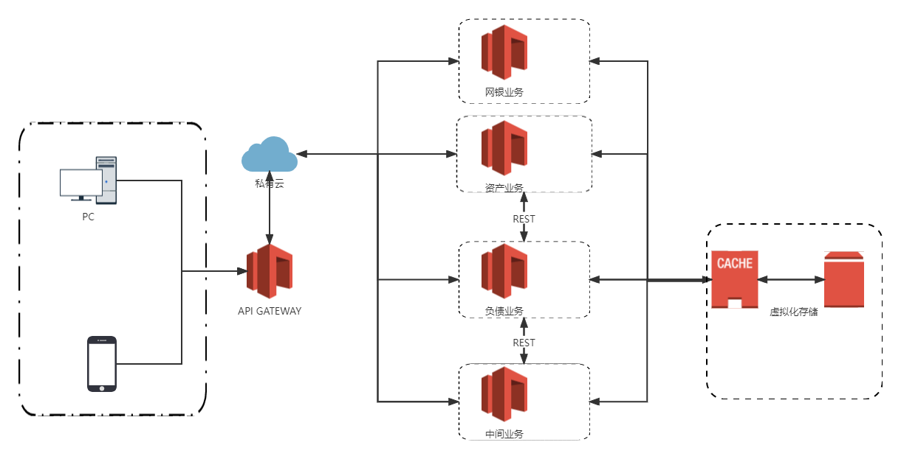

# 银行存储系统设计方案

1. 虚拟化（云）平台 （可考虑直接构建私有云环境）
2. 100%的冗余方案
3. 100TB 每年增长30% 满足3年
4. 业务部门的划分 生产业务区、综合管理区、网银在线区、产品测试区、运维基础区
5. 非结构化数据
6. 网络拓扑设计 带宽 高峰和低谷期
7. 系统设计 硬件冗余和集群
8. RPO接近于0，尽量没有数据丢失，RTO尽可能小
9. 高扩展性，而且以虚拟化部署为主
10. 数据安全 隐私性
11. 容灾规划


## 一、问题背景

随着金融产业的不断升级，金融信息化已成为金融行业的重要环节。银行在央行与银保监会等机构的监督和管理下，信息化进程逐步加快推进。随着业务的变化和云计算技术的的成熟，应用场景和需求变化越来越难以控制，银行业务高速发展，某500强银行原有平台CDC传统的数据中心解决方案已经满足不了目前的应用需求的大量迭代，同时设备和应用的运维挑战难度极高。如何在技术和业务双层面优化存储系统，成为摆在该银行面前的重要挑战。总部决定构建大中华区全新的虚拟化（云）平台，采用成熟的虚拟化方案构建虚拟化数据中心，需要一套虚拟化实施方案。

## 二、需求分析

### 1. 业务部门划分需求

银行业务可分为五个分区，生产业务区、综合管理区、网银在线区、产品测试区、运维基础区，产生的数据主要都是非结构化数据。为了保证数据的安全，可访问性应根据不同业务进行划分，每个区的权限与资源分配有差别，具体划分如下：

* 生产业务区：生产业务相关数据读写权限；面向客户的核心数据，分配可用性最高的存储资源
* 综合管理区：所有权限；普通的存储资源
* 网银在线区：相关数据读写权限；面向客户的核心数据，分配可用性最高的存储资源
* 产品测试区：测试数据的读写权限；普通的存储资源
* 运维基础区：生产业务区和网银在线区的数据读写权限；普通存储资源

### 2. 带宽需求

需要先由业务制定业务指标（最大并发用户，吞吐量，响应时间等），让性能测试组根据预定业务指标去进行业务系统压力测试，根据业务高峰期时的网络资源使用情况估算下生产环境的网络带宽等网络配置。

### 3. 数据完整性

银行业务系统和办公系统作为主要系统，必须为系统用户提供准确的数据访问服务，故数据的完整性是重要需求。

### 4. 数据可用性与容灾

银行存取款业务需要7*24工作，其他核心业务也要求极高的可用性，数据丢失的代价极大，对于数据保存的要求非常严格，所以设计好系统的高可用性极为重要，必须保证RPO接近于0，尽量没有数据丢失，RTO尽可能小，可以容忍一小段时间的宕机。银行系统产生的用户数据，是银行非常重要的资产，一旦数据损失，后果是灾难性的。为了保证业务的可连续性(BC)，必须对存储系统做好灾备，本地数据备份和异地灾备中心都是非常重要的容灾手段。

### 5. 数据机密性

银行数据都具有很强的隐私性，所以必须保证数据机密性，防止不拥有权限的用户非法访问数据。

### 5. 系统可拓展性

随着银行业务的不断扩大，用户数据的不断累计，所需要的存储空间至少随着线性速度增长，所以存储系统必须具备很高的可扩展性，并且通过虚拟化部署使得扩展过程更简单、快捷。

## 三、目标设计


## 四、存储方案设计

https://blog.51cto.com/u_15127572/2726299

https://www.talkwithtrend.com/Article/253157

### 4.1 业务划分

根据目前规划的5个分区：**生产业务区、综合管理区、网银在线区、产品测试区、运维基础区**，由于每个分区对于虚拟机的数量以及性能上的需求不同，故分配方案如下：

#### 生产业务区

银行的业务总体可以分为**资产业务、负债业务、中间业务**三类，因此生产业务区的设计可以主要根据这三类业务分配虚拟机。三类业务的每类任务都部署装有同样软件的虚拟机，并根据操作员人数分配相应数量的终端服务器。

因此我们为每类业务分配一台高配置虚拟机作为终端服务器。从而满足每类业务异构性的需求，服务器与终端之间形成一对多的映射，最终所需的主机资源数为终端数与终端服务器数求和。

#### 综合管理区

综合管理区拥有最高的数据操作权限，但由于其不是面向用户的核心业务，对可用性、并发的要求并不高，只需要分配普通配置的虚拟机作为终端服务器以及满足需求的虚拟机数量即可。

#### 网银在线区

网银在线区承担银行的网银业务，该区域的特点是访问量随时间变化较为明显，峰值可能很高。所以网银在线区需要根据当前实际网银业务访问量动态调整虚拟机的数量，从而对网银业务实现负载均衡；同时由于网银在线区的虚拟机需要作Web服务器使用而终端服务器使用，因此网银在线区的服务器需要承载更高的业务量，这也要求每台虚拟机需要更高的配置。

#### 产品测试区

产品测试区需要为银行的新产品进行测试，但是总体需求的资源比较少，分配一台与生产环境相同或相似的虚拟机即可，如果进行抗压测试则根据具体情况进行调整。

#### 运维基础区

运维基础区需要对银行所有业务分区供运维服务，运维需要进行数据的直接访问，故运维基础区需要尽可能稳定的网络环境，因此直接分配客户虚拟机是较好的选择。于是在运维基础区对生产业务区的三个终端服务器、网银在线区、综合管理区各分配一台虚拟机作为运维使用的虚拟机。

### 4.2 分级存储

#### 4.2.1 基础设施

采用分布式存储方案，因为银行每天的数据量相当大，需要的磁盘等存储设备数量也很多。如果使用集中式存储建设周期太长，架构复杂，故障排查难度大，而且扩展性不够好，所以采用分级存储的三级架构。银行数据从产生到存储、利用、归档，最后超过存储期限被删除，数据被读取的频率逐渐下降，数据存储的位置也应该随之变化，以提高存储设备的使用率，降低存储成本。因此有必要进行分级存储，因此考虑采用在线(On-line)存储、近线(Near-line)存储和离线(Off-line)存储三级存储方式。在存储其关键或者近期业务数据时，采用昂贵的存储设备、存储技术和存储方式；而对于时间较为久远，访问量不大的数据存放在性能较低的存储设备，但对这些设备的要求是寻址迅速、传输率高；最后通过离线存储对时间久远的数据进行归档，要求设备具有高可靠性、良好的安全性、大容量和低成本。

**SAS和SATA区别**

机械硬盘主要为SATA和SAS接口，目前家用类别的移动硬盘多为SATA接口，SAS接口则为企业级应用。SAS可满足高性能、高可靠性的应用，SATA则满足大容量、非关键业务的应用。


RAID （ Redundant Array of Independent Disks ），通常简称为磁盘阵列。简单地说， RAID 是由多个独立的高性能磁盘驱动器组成的磁盘子系统，从而提供比单个磁盘更高的存储性能和数据冗余的技术。 RAID可以在部分磁盘（单块或多块，根据实现而论）损坏的情况下，仍能保证系统不中断地连续运行。在重建故障磁盘数据至新磁盘的过程中，系统可以继续正常运行，但是性能方面会有一定程度上的降低。一些磁盘阵列在添加或删除磁盘时必须停机，而有些则支持热交换 （ Hot Swapping ），允许在不需要停机的情况下替换磁盘驱动器。这种高端磁盘阵列主要用于要求高可能性的应用系统，系统不能停机或尽可能少的停机时间。RAID技术主要包含RAID 0~RAID 7等数个范围，它们的功能和优劣各不相同。

#### 4.2.2 在线存储配置

对于在线存储，由于该部分的银行业务属于要求高频率读取、数据恢复能力强的类型，而且需要尽可能避免数据丢失，属于对数据安全等级要求非常高的场合，故考虑使用RAID 6，RAID 6采用双分布式奇偶校验，尽管实现代价很高，控制器的设计也比其他等级更复杂、更昂贵，但是为了保证该银行高数据访问并发性以及数据丢失恢复的要求，因此考虑使用RAID 6分布式存储并且搭配4个热备盘，从而进一步提升系统对于磁盘错误的容忍能力。硬件选择方面，SSD硬盘有着现阶段最优的读写速度，同时由于其中没有活动的机械部件，存于其中的数据不易损坏，因此适合数据交换频繁的在线存储。

#### 4.2.3 近线存储配置

对于近线存储，如果仍然使用RAID 6则成本较高，得不偿失，而RAID 5同样提供了存储数据和分布式奇偶校验数据的能力，数据块和对应的校验信息存保存在不同的磁盘上，当一个数据盘损坏时，系统可以根据同一条带的其他数据块和对应的校验数据来重建损坏的数据；RAID 5磁盘利用率较高，兼顾存储性能、数据安全和存储成本等各方面因素，选用RAID 5是一种较为折中的方案。硬件选择方面，使用SAS硬盘，SAS是新一代的SCSI技术，采用串行技术以获得较高的传输速度，相比于SSD成本较低。

#### 4.2.4 离线存储配置

对于离线存储，由于要求容量大且成本低，如果仍然采用之前的存储方案，成本都将较为高额的同时带来了繁重的管理开销；故考虑采用CAS架构来对超过一年的数据进行归档，理由如下：

1. 降低存储管理开销。无需重新配置的可扩展性 CAS的优秀功能提供了自我配置、自我管理和自我修复能力，这些特性再结合CAS的RAIN架构，有助于硬件的扩展，而且在扩充容量时不会带来中断。CAS可自动进行存储管理，从而降低总体拥有成本，提高投资回报率。

2. 保障数据安全可靠。数据的安全性、完整性、正确性直接影响档案服务质量，因此存储系统需要具有很强的数据安全性，必须能够采用一些高级的数据存储保护技术。CAS系统设备全部为冗余设计, 没有单点故障。为了确保内容的完整可靠，CAS为每个存储对象指定一个唯一的内容地址。这个地址是由内容本身衍生而来的，同一内容绝不会重复保存。数据全部采用镜像或奇偶效验方式存储, 即使发生磁盘及某个存储部件损坏的情况，也不会出现数据丢失，而且CAS具有自我治愈功能，因此对服务的要求也大大降低。

3. 降低总体拥有成本。CAS方案使用户可以规划业务系统的全在线存储模式，真正实现所有归档数据全部处于在线状态，为系统的快速响应能力提供完全保障。由于磁盘阵列成本的主要部分是硬盘，而硬盘单位存储容量的价格通常会呈明显下跌的趋势，逐年扩展CAS容量可以作为用户控制存储投资的首选方式。采用CAS方案，可以省去传统归档存储方案中昂贵的光盘库或磁带库的长期投资，使系统整体投资水平和执行效率都可同时获得优化。
4. 硬件选择方面，这一级中要求设备具有高可靠性、良好的安全性、大容量和低成本，因此选择SATA磁盘阵列。

### 4.3 容量规划

（1）根据以往银行业务办理经验，我们认为一个月内的业务办理数据是最活跃的，数据会在近期被频繁调用，所以第一级存储将存放一个月内的数据。考虑到此级存储中的数据活跃性、重要性等方面的因素，使用RAID 6阵列 ，在灾备方面将采用零PRO同步远程镜像的方式。由于受到此级存储总数据量的约束，即使在使用了诸多高成本的设备和方案的情况下，也不会产生太高的费用。在线数据存储空间需求至少要满足第三年数据增长的需求，即至少需要能存下第三年的一个月的数据量。

一级在线数据存储空间需求：

```mathematica
100TB * ((1+30%)^3 - (1+30%)^2) * (1/12) = 4.225TB
```

配置冗余100%的存储空间后的总存储空间需求为：

```mathematica
4.225 TB * 2 = 8.45 TB
```

2T NVME SSD  单盘成本为5000元, RAID 6利用率为$(n-2)/n$，计算$n * 2\ TB  *  (n-2)/n  >=  8.45\ TB$得 $n > 6.225$，需要至少7块SSD，成本为

```mathematica
7 * 5000 = 35000 元
```

（2）银行业通常要求，银行在线系统的所保存的业务数据不得少于1年^[1]^，所以我们设计二级近线存储存储一年内除当前最近一个月的其他数据量，数据利用率将显著下降，但仍有一定频率，对磁盘阵列的读写性能级数据保护的要求略低于前者，使用RAID 5阵列。由于此级存储中的数据也是经常被调用的，仅仅是频率相对第一级较低，所以使用分钟级PRO的异步远程镜像方式，这样既满足了基本要求，又节约了部分成本。近线数据存储空间需求至少要满足第三年数据增长的需求，即至少需要能存下第三年的十一个月的数据量。

二级近线数据存储空间需求：

```mathematica
100 TB * ((1+30%)^3 - (1+30%)^2) * (11/12) = 46.475 TB
```

配置冗余100%的存储空间后的总存储空间需求为：

```mathematica
46.475 TB * 2 = 92.95 TB
```

2T SAS 15000转磁盘，单盘成本为2000元,RAID 5利用率为$(n-1)/n$，计算$n * 2\ TB  *  (n-1)/n  >=  92.95\ TB$得$n > 47.475$，需要至少48块SAS，成本为

```mathematica
48 * 2000 = 96000 元
```

（3）一年前的数据调用频率就相对较低了，但此级存储的数据量非常大，所以磁盘和阵列的性能并不是要考虑的首要因素，我们仍然使用RAID 5阵列，并且每天进行异步远程备份，采用CAS架构来对超过一年的数据进行归档。

三级近线数据存储空间需求：

```mathematica
100 TB * (1+30%)^3 - 46.475 TB - 4.225 TB = 169 TB 
```

配置冗余100%的存储空间后的总存储空间需求为：

```mathematica
169 TB * 2 = 338 TB
```

12T SATA 15000转磁盘，单盘成本为3000元,RAID 5利用率为$(n-1)/n$，计算$n * 12\ TB  *  (n-1)/n  >=  338\ TB$ 得$n > 29.17$，需要至少30块SAS，成本为

```mathematica
30 * 3000 = 90000 元
```

（4）综上所述，总成本为

```mathematica
35000 + 96000 + 90000 = 221000 元
```

### 4.4 非结构化数据

#### 4.4.1 现状

当涉及到非结构化数据存储时，NAS和对象存储都有各自的优点。NAS是一种传统的、可靠的存储系统，它的层次结构和有组织的格式使文件易于分类和排序。NAS速度快、用户友好且得到广泛支持。然而，NAS缺乏可伸缩性，至少与对象存储相比是这样。

对象存储系统不使用严格的格式，而是使用元数据来描述数据，并根据属性(如名称、创建日期和位置)对数据进行排序。对象存储是高度可伸缩的，这使得增加容量变得很容易。然而，对象存储系统更可能缺乏性能。虽然看起来对象存储更有优势，但是这两种存储系统各有优缺点。

#### 4.4.2 策略

采用OSD系统，OSD 系统通常包含三个关键组件：OSD节点、内部网络、存储

基于对象存储的主要优势：

| 优势           | 描述                                                         |
| -------------- | ------------------------------------------------------------ |
| 安全性和可靠性 | （1）通过专用算法生成的唯一对象ID可确保数据完整性和内容真实性（2）请求身份验证在存储设备中执行 |
| 平台独立性     | （1）因为对象是数据的抽象容器，所以它支持异构跨平台共享对象（2）此功能使基于对象的存储使用于云计算环境 |
| 可扩展性       | OSD节点和存储均可独立地进行扩展                              |
| 可管理性       | （1）具有管理对象的固有智能（2）具有自我修复功能（3）基于策略的管理功能使OSD能够自动处理日常作业 |

在此情景下，主要需要基于云的存储，基于对象存储十分适合，同时为了减少开销，采取统一存储，统一存储可在一个统一平台中整合数据块、文件和基于对象的访问，不仅支持数据访问的多个协议，还可以通过单个管理界面进行管理。

在市场上已有的对象存储方案中，选择EMC Atmos和EMC VNX。

EMC Atmos是具备巨大扩展能力的基于对象的存储，可以按两种方式部署：专门构建的硬件应用装置或虚拟机(VM)；EMC VNX在一个解决方案中整合数据块、文件和对象访问的统一存储
平台，支持通过存储处理器的数据块访问，通过 X-Blade 的文件访问，通过 EMC Atmos VE 的对象访问。

#### 4.4.3 进一步优化

如果同时还希望提高存储系统的性能，那么利用闪存来帮助处理非结构化数据是值得的。闪存成本继续下降，使其替代硬盘成为更多工作负载的可行选择。由于对象存储难以提高性能，使用混合或全闪存可以显著提高速度。随着性能的提高，基于闪存的SSD消耗更少的电量，占用更少的空间。在这样的问题中，虽然成本有些昂贵，合理利用闪存还是非常必要的。

合理利用分层存储，但是随着非结构化数据的兴起，对适当分层的需求得到了重视。使用自动存储分层，为非结构化数据分配类别，这样就可以方便地存储某些频繁访问的数据，而不那么重要(但仍然是必要的)的数据则被搁置一边。在非结构化之下有非常多的数据类型，以这种方式对其进行优先级排序可以提高性能并管理存储成本。

## 五、容灾规划

### 5.1 容灾概述

灾难恢复可以分为六个等级，由低至高依次为基本支持、备用场地支持、电子传输和部分设备支持、电子传输及完整设备支持、数据零丢失和远程集群支持。每个等级都有数据备份系统、备用数据处理系统等七个要素，分别有对应的容灾方案，一般来说数据越重要，容灾等级就应当越高。

在考虑容灾方案时，应当综合多方因素，而不是简单地以最高等级为目标，应当寻找最合适的总体投入（TCO）和投资汇报（ROI），用户应根据数据的重要性确定相应的容灾等级。根据对系统的保护程度来分，容灾系统可以分为数据容灾和应用容灾。

数据容灾，就是至少在异地保存一份可用的关键业务数据，该数据可以是与本地生产数据的完全实时复制，也可以比本地数据稍微落后，但一定是可用的。

应用容灾，是在数据容灾的基础上，在异地建立一套完整的与本地生产系统相当的备份应用系统。这样一套系统相对比较复杂，除了数据复制还包括网络、主机、应用、甚至IP等资源，以及各资源之间良好协调。

一个完善的容灾系统主要包括三个层次：数据容灾，应用容灾和网络容灾；两个级别：本地高可用性，异地容灾。

1. 数据容灾就是指建立一个异地的数据系统，该系统是本地关键应用数据的一个同步或异步复制。
2. 应用容灾是在数据容灾的基础上，在异地建立一套完整的与本地生产系统相当的备份应用系统（可以是互为备份），在灾难情况下，远程系统迅速接管业务运行。
3. 网络容灾是指在灾难发生后，当应用系统完成正确的迁移后，将访问应用系统的网络流量正确的导向远程的容灾系统。
4. 本地高可用性是指可通过高可靠性的集中存储，高可靠性的虚拟计算体系为客户提供本地高可用性。

对于银行的数据，需要进行容灾方案设计以应对突发灾难。对于本地本级备份，建立了在线、近线、离线等多级存储备份系统，充分利用先进的备份手段和备份策略，形成完整的本地备份管理解决方案；备份的数据包括操作系统、数据文件以及应用服务环境等多个方面；日常访问的重要数据采用磁盘或者虚拟带库方式备份，归档数据和非重要数据采用磁带库方式备份；重要数据应至少保证每周做一个全量备份，平时做增量备份。由于在存储方案设计过程中已经充分考虑了服务器的存储备份机制，本地的容灾问题通常可以被及时解决，不会导致严重的后果。因此，在容灾方案的设计中，我们需要重点考虑遇到重大灾害，导致本地的系统和数据全部无法及时恢复时，启用在异地设置容灾中心的远程容灾方案。

在远程的容灾系统中，要实现完整的应用容灾，既要包含本地系统的安全机制、远程的数据复制机制，还应具有广域网范围的远程故障切换能力和故障诊断能力。也就是说，一旦故障发生，系统要有强大的故障诊断和切换策略制定机制，确保快速的反应和迅速的业务接管。容灾功能基本要求是在异地建立独立的容灾备份中心，保证在发生灾难时对数据保护。对于银行而言，RPO的需求不需要过高，但仍需保证一定的容灾能力。因此可以采用异步复制模式将本地数据保存到远程的数据中心。

这里，我们采用双活数据库技术，建立双活数据中心，双活数据库技术的定义是：部分数据库复制容灾软件，能够实现生产中心和灾备中心数据库双活，即灾备中心的备份数据库也处于Open状态，客户端可对灾备数据库进行只读访问（例如GoldenGate、DSG等数据库复制软件）。生产中心和灾备中心数据库保持双活，可提高灾备中心的资源利用率，分担生产中心的业务负担，在发生灾难时，自然也可以实现应用和业务的接管。

### 5.2 存储选型原则

对于存储选型方面，我们需要高可靠，即业务连续性支持，架构级高可用和设备级高可靠；高性能，即高带宽、低时延的架构，满足不用应用系统的性能要求以及支持业务快速上线；易管理和维护，必须具备自动化部署和配置、数字化管理和容灾架构管理；良好的可扩展和可演进性，必须满足未来3年的规划，支持向“双活”数据中心演进。

### 5.3 容灾方案

#### 5.3.1 两地三中心方案

基于对主存储性能保证的考虑，我们选用华为的同城双活+异地远程复制的两地三中心存储容灾保护方案。它的优势在于：

1. 高端全闪存满足核心系统对于性能的要求（低于1ms的稳定时延），且满足未来3~5年的业务扩展需求及新业务快速上线的需求；
2. 高端全闪存“四坏三”架构提升单存储可靠性；
3. 同城双活方案RPO=0、RTO≈0，高标准满足监管要求；
4. 基于A-A架构的双活，两端存储都支持数据读写，减少了年度容灾演练步骤，大幅缩短演练变更操作时间和步骤；
5. 后期平滑演进“四副本”等容灾方案，创新方案能力领先。

#### 5.3.2 方案架构

两地三中心为用户提供了灵活的组网方式，用户可根据现有网络情况和对容灾备份RPO及RTO的要求来初步选择组网方式。

（1）级联组网

在级联组网方式中，生产中心与同城灾备中心之间采用同步数据复制技术，而同城灾备中心与异地灾备中心之间采用远程异步数据复制技术。这种方式中，生产中心与同城灾备中心之间有着密切的关系，如果中间的线路或同城灾备中心的存储设备有任何故障时，整个数据复制过程将停止。

同时，当同城容灾中心出现故障时，生产中心和远程容灾中心将失去联系，即生产中心的数据不能及时复制到异地灾备中心，造成生产数据没有容灾保护，容灾中心建设失去意义。因此这种级联容灾架构的容灾防护和适应能力较差。

（2）并联组网

在并联组网方式中，生产中心与同城灾备中心之间采用同步数据复制技术，生产中心与异地灾备中心之间采用异步数据复制技术。

这种方式中，生产中心与同城灾备中心之间是相对独立的关系，如果中间的线路或同城灾备中心的存储设备有任何故障时，异步数据复制不会受到任何影响，数据异步复制正常进行。当数据复制线路或同城灾备中心的存储设备故障排除后，生产中心会将所有更新的数据复制到同城灾备中心。反之异步数据复制链路和远程中心出现故障，同城同步容灾也不会受到影响。提供了较好的数据保护架构。

（3）同机房双活+异步复制组网

在同机房双活+异步复制组网方式中，生产中心采用两台存储，存储之间数据完全同步，生产中心与异地灾备中心之间采用异步数据复制技术。
这种方式中，生产中心任意一台存储出故障，不会影响生产系统的正常运行。但生产中心整个中心出故障后，需要承担丢失部分数据的损失。

（4）跨数据中心双活+异步复制组网

在跨数据中心双活+异步复制组网方式中，生产中心和同城灾备中心的存储是双活的，存储之间数据完全同步，同城灾备中心与异地灾备中心之间采用异步数据复制技术。
这种方式中，生产中心存储出故障，不会影响生产系统的正常运行。它集合了并联组网和同机房双活的优点，同时去除了他们的缺点。因此我们采用这种组网模式，组网架构如下：



由生产中心通过DWDM链路同步复制到同城灾备中心、SDH线路异步复制到异地灾备中心构成。在这种组网方式中，A-B之间是光纤组网，B-C之间是iSCSI组网，可实现的RPO=0，A-B可实现的RTO=0，B-C之间可实现的RTO依赖于主机业务和故障场景。

## 六、网络架构设计

要点：**存储网络的架构组成** **网络拓扑**

**新型数据中心：扁平网络拓扑和聚合存储**

转到更扁平网络的数据中心是为了减少交换层次数量，以消除延迟和降低管理复杂性，供应商承诺采用一些预标准技术，如多链路透明互联(TRILL)[和思](https://www.dqsheffield.com/hkhs)科的叠加传输虚拟化(OTV) 来实现这个目标。

这迫使网络工程师和架构师必须仔细了解许多专利技术。这样，他们最终会面临许多新架构和技术选择--这意味在投入资源之前需要进行更多的研究。

为了转到这种新型数据中心网络并实现私有云，架构师还必须使用数据中心桥接、以太网光纤通道(FCoE)或I/O虚拟化技术，来整合数据中心和存储基础构架，从而减少安装[服务器](https://www.dqsheffield.com/server/)机架所需要的布线、网络接口卡(NIC)和主总结适配器。

**使用虚拟化集群交换技术来管理扁平网络**

UCLA神经成像实验室(LONI)对大脑进行绘图，并持续将扫描数据保存到将近PB存储量的影像数据库，1,000名研究人员会不停地访问这个数据库，以了解和治疗老年痴呆症和精神分裂症等疾病。同时上百名研究人员会同时在线处理从20MB至几百GB的数据。

LONI最近实施了一个无阻塞扁平2层协议网络，直接将所有机架服务器相连，但是它所采用的是虚拟集群交换技术，即对顶级机架[交换机](https://www.dqsheffield.com/module/27720.html)进行分组，通过一个虚拟机架将它们进行统一管理，从而提高网络管理效率。

除了高性能数据中心，随着封闭的[企业数据中心](https://www.dqsheffield.com/k/server/2009-6/625322.html)开始在地理上分散各地，虚拟机架在企业网络管理中发挥了中枢作用。目前，大多数集群交换或虚拟机架解决方案的缺点是互操作性不强。

**云网络需要扁平化和以太网结构**

网络供应商认为对于网络而言，简单性和优化要比扁平更为重要。云自动化，即按需分配和收回服务器、存储、网络、应用程序，是非常重要的。

供应商的自动[化工](https://www.dqsheffield.com/industry/1617.html)具和接口根据硬件的不同而不同，特别是专门的交换[操作系统](https://www.dqsheffield.com/module/27659.html)，这就是为什么数据中心内网络的优先级不高。但是通过使用标准来提升互操作性，从而简化数据中心网络的自动化负载分配任务，或者由网络管理员以一个交换机、一个交换结构视图来管理网络基础架构，有利于保证平稳地过渡到以太网结构和未来的开放网络[软件](https://www.dqsheffield.com/industry/1593.html)。

### 6.1 存储区域网络

选用FC-SAN构建在线存储和近线存储的网络，理由如下：

1. 具有出色的可扩展性。SAN比传统的存储架构具有更多显著的优势。例如，传统的服务器连接存储通常难于更新或集中管理。每台服务器必须关闭才能增加和配置新的存储。相比较而言，FC-SAN不必宕机和中断与服务器的连接即可增加存储。FC-SAN还可以集中管理数据，从而降低了总体拥有成本。
 2. 节省网络带宽。利用光纤通道技术，FC-SAN可以有效地传输数据块。通过支持在存储和服务器之间传输海量数据块，SAN提供了数据备份的有效方式。因此，传统上用于数据备份的网络带宽可以节约下来用于其他应用。
 3. 具有灵活性。开放的、业界标准的光纤通道技术还使得FC-SAN非常灵活，FC-SAN克服了传统上与SCSI相连的线缆限制，极大地拓展了服务器和存储之间的距离，从而增加了更多连接的可能性。改进的扩展性还简化了服务器的部署和升级，保护了原有硬件设备的投资。
 4. 更好地控制存储网络环境。FC-SAN可以适合那些基于交易的系统在性能和可用性方面的需求。SAN利用高可靠和高性能的光纤通道协议来满足这种需要。
 5. 传送数据块到企业级数据密集型应用能力较好。在数据传送过程中，FC-SAN在通信结点（尤其是服务器）上的处理费用开销更少，因为数据在传送时被分成更小的数据块。因此，光纤通道FC-SAN在传送大数据块时非常有效，这使得光纤通道协议非常适用于存储密集型环境。

### 6.2 整体网络拓扑结构图



### 6.3 数据安全

在云计算中，我们在计算、网络、存储方面都必须做出足够安全的设计。

#### 6.3.1 保护网络

由于我们采用FC-SAN构建在线存储和近线存储的网络，故采用如下基本安全策略：

1. LUN 掩蔽和分区

2. 保护 FC 交换机端口

   （1）端口绑定：限制可连接至特定交换机端口的设备，仅允许相应交换机端口连接到节点进行结构访问

   （2）端口锁定和端口停用，限制交换机端口的初始化类型

   （3）永久禁用端口，阻止启用交换机端口，即使在交换机重新启动后也一样

3. 交换机范围内和结构范围内的访问控制

   （1）访问控制列表 (ACL)，包括设备连接和交换机连接控制策略

   （2）结构绑定，阻止未经授权的交换机连接结构

   （3）基于角色的访问控制 (RBAC)，支持将角色分配给明确指定访问权限的用户

4. 结构的逻辑分区：VSAN

   （1）支持通过常见物理 SAN 创建多个逻辑 SAN

   （2）一个 VSAN 中的结构事件不会传播到其他 VSAN

   （3）应为每个 VSAN 配置分区

在上层IP链路中，一方面依靠网络层防火墙建立隔离区DMZ抵御IP网络中的安全威胁，另一方面依靠IP SAN中的CHAP协议提供验证。

#### 6.3.2 保护存储

1. 访问控制和数据加密
2. 对虚拟机配置文件和虚拟机数据使用单独的 LUN
3. 隔离虚拟机通信和管理通信

#### 6.3.3 保护计算

即保护保护物理服务器、虚拟机和虚拟机管理程序，可选择已经付诸实践的RSA 安全产品

1. RSA SecureID提供二元身份验证
2. RSA 标识和访问管理，为物理、虚拟和基于云的环境提供标识、安全和访问控制管理
3. RSA Data Protection Manager支持加密部署、令牌化和企业密钥管理

## 六、虚拟化方案

要点：**虚拟化后共享存储容量的规划**


根据统计数据，私有云仍然非常流行，但是什么使它如此出色呢？以下是私有云技术的一些优点：

- 易于掌控
  专用云通常位于现场或数据中心提供商处，因此在需要时更易于访问。您的IT团队可以有效地管理平台并在需要时进行更改。他们可以预测停机时间和服务交付瓶颈。他们还可以更好地根据公司需求调整资源的使用。另一方面，使用公共云的人在管理其资源方面没有那么多的灵活性。
- 稳定性
  云计算在很大程度上取代了硬盘，计算机，闪存驱动器和USB。尽管它仍然使用许多不同类型的驱动器来构建其存储平台，但它还通过将数据分发到安全的托管站点并确保所有内容保持在线状态，从而提供了更高程度的数据安全性。但是，为了获得最佳保护，您需要适当的协议以及全面的灾难恢复和备份解决方案。
  私有云对于存储敏感文件特别方便，因为您的内部团队负责确保平台持续运行。您不必担心供应商或邻居的活动会影响系统，并且可以更有效地管理基础结构。
- 定制化
  您可以按照最适合您和业务需求的方式配置平台。它们可以适应不同规模，行业，间接费用，目标和其他因素的公司。查看您公司的要求，然后根据可用性，安全性和可伸缩性需求，确定最适合您的方案。
- 合规性
  通过完全控制云存储和带宽，自定义环境或调整安全设置的能力，公司可以更好地控制其基础架构。他们可以根据自己的业务目标构建一个符合相关法律和行业法规的平台。与公共云相反，私有云数据更难成为外部检查或恶意截取的对象。

## 七、云化的微服务方案

银行系统的业务中，**生产业务**（主要分为资产业务、负债业务、中间业务）和**网银业务**要求高并发、高可用和高可扩展性，可能对系统造成的压力较大， 使用微服务架构便于横向拓展和弹性伸缩。而对于产品测试、基本运维和管理系统，则没有必要使用微服务架构。

将资产业务、负债业务、中间业务和网银业务都被打包和部署为离散的独立程序，服务实例应迅速启动，服务的每一个实例都是完全相同的。由于虚拟化方案使用了私有云，服务将部署到虚拟机镜像中。 微服务优点之一就是能够快速启动和关闭微服务实例，以响应可伸缩性和服务故障事件.  微服务可以打包在虚拟机镜像中，然后开发人员可以在私有云中快速部署和启动服务的多个实例，方便弹性调整。

 基于云的微服务以弹性的概念为中心。在需要时，可以在云上几分钟之内快速布置启动新的虚拟机和容器，如服务需求下降，可以关闭虚拟服务器；如果遇到业务高峰期，则可以快速增加虚拟服务器的数量，这样可显著提高应用程序的水平可伸缩性，也使应用程序更有弹性。



## 八、业务的标准化定制


## 参考文献

[1]  王国荣，沈固朝等著，信息化保密知识读本，苏州大学出版社，2010，131-139

